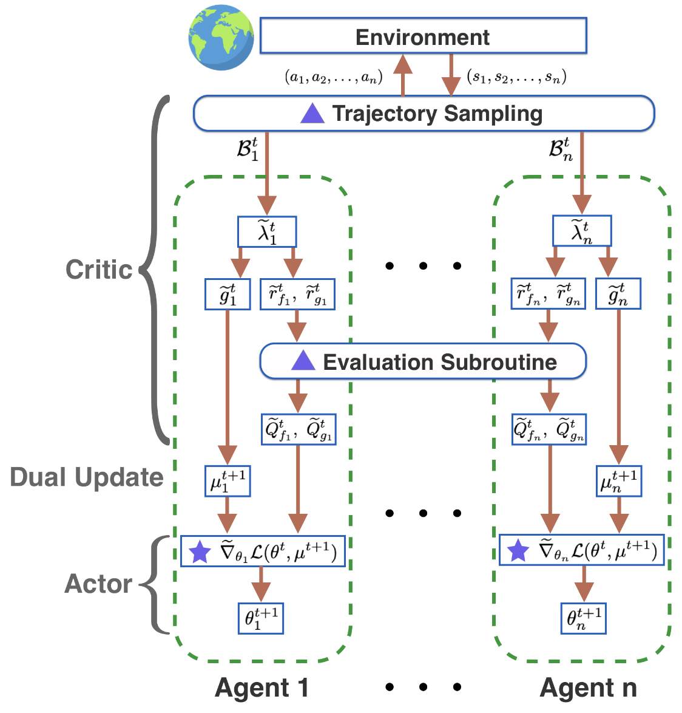
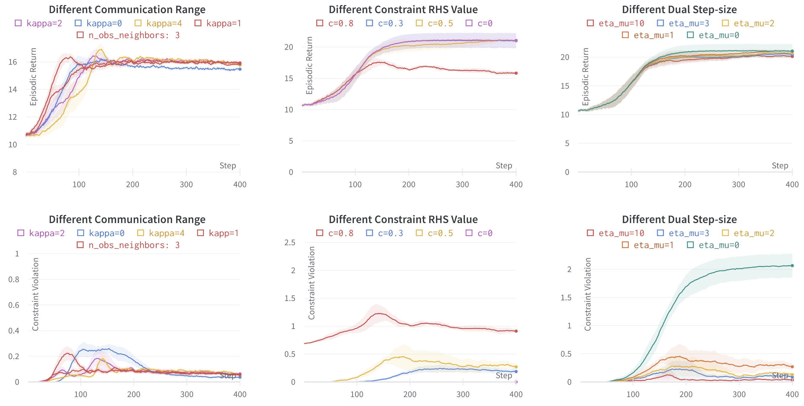
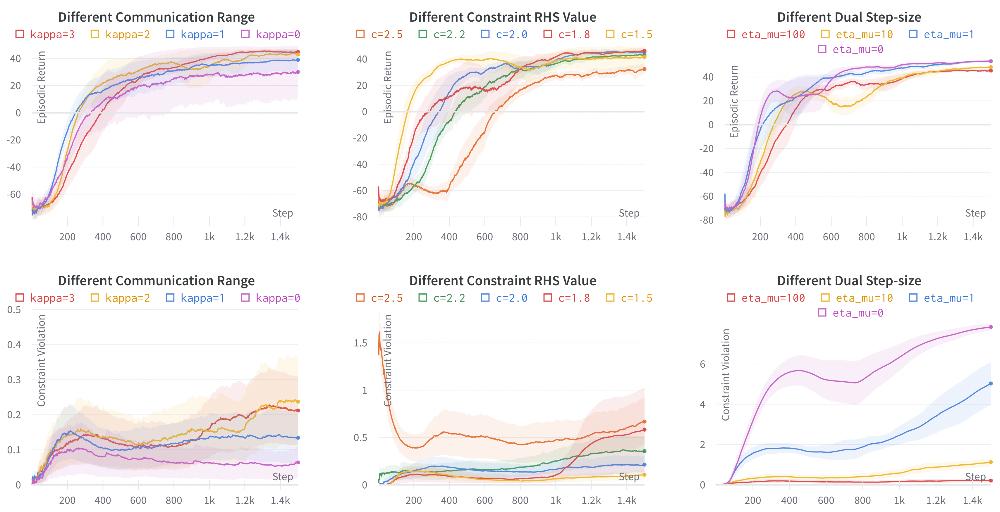
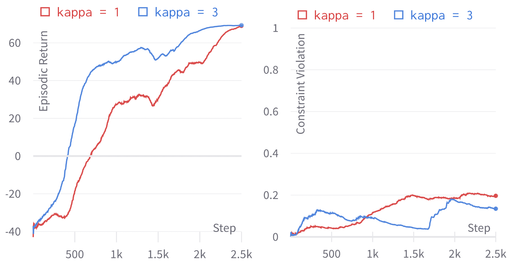
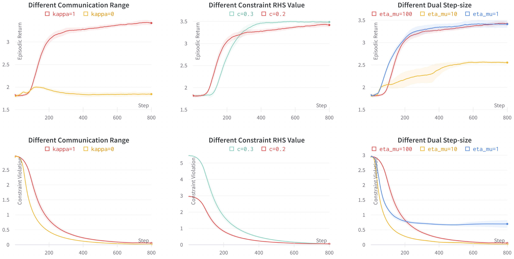
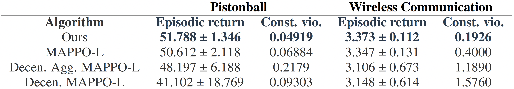
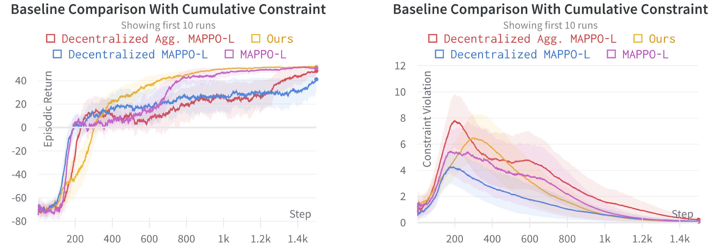
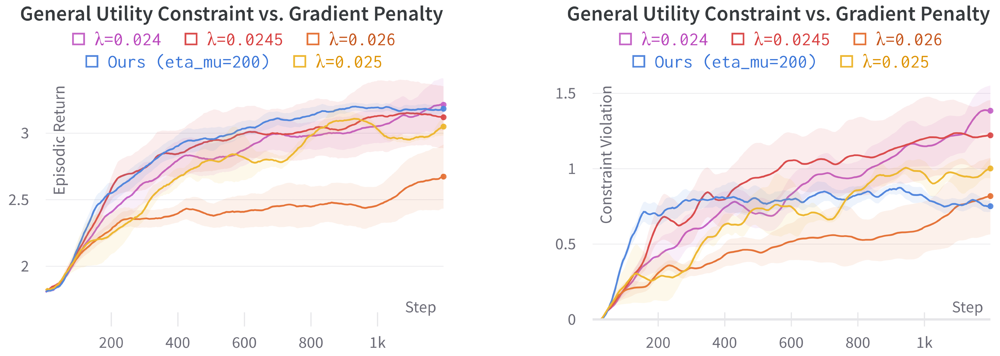
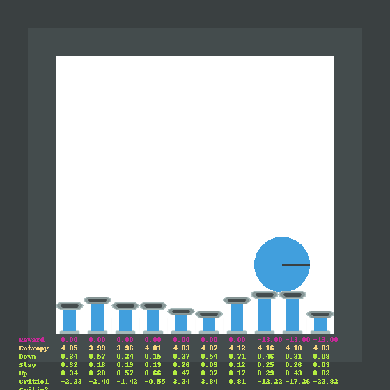
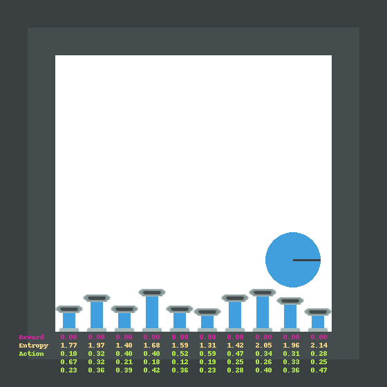

# Scalable Primal-Dual Actor-Critic Method for Safe Multi-Agent Reinforcement Learning with General Utilities (2023)
Authors: Donghao Ying, Yunkai Zhang, Yuhao Ding, Alec Koppel, and Javad Lavaei.

## Citation
If you find this repo useful, please cite our paper.
```
@inproceedings{ying2023Scalable,
  title={Scalable Primal-Dual Actor-Critic Method for Safe Multi-Agent Reinforcement Learning with General Utilities},
  author={Donghao Ying and Yunkai Zhang and Yuhao Ding and Alec Koppel and Javad Lavaei},
  booktitle={Advances in Neural Information Processing Systems},
  year={2023}
}
```

## Introduction
We investigate safe multi-agent reinforcement learning, focusing on the setting where 
- each agent is associated with a local objective function and a local constraint function, defined by general utilities;
- each agent only has access to the observation/action/Q-function of other agents that are within its $\kappa$-hop neighborhood;
- the agents aim at jointly maximizing the aggregate sum of local objectives while satisfying their own safety constraints.

Our main contribution is the development of a scalable algorithm with theoretical guarantees. We also performed numerical experiments to validate the proposed algorithm.


## Key theoretical takeaways
In view of the challenges presented by global observation/communication in large networks, we focus on the setting of **distributed training without global observability**. Our technical contributions are summarized as follows:
- Compared with existing theoretical works on safe MARL ([Lu et al., 2021](https://ojs.aaai.org/index.php/AAAI/article/view/17062), [Mondal et al., 2022](https://arxiv.org/abs/2209.07437), [Gu et al., 2022](https://arxiv.org/abs/2110.02793)), we present the first safe MARL formulation that extends beyond cumulative forms in both the objective and constraints.  We develop a truncated policy gradient estimator utilizing shadow reward and $\kappa$-hop policies under a form of correlation decay property, where $\kappa$ represents the communication radius. The approximation errors arising from both policy implementation and value estimation are quantified. 
- Despite of the global coupling of agents' local utility functions, we propose a scalable Primal-Dual Actor-Critic method, which allows each agent to update its policy based  only on the states and actions of its close neighbors and under limited communications. The effectiveness of the proposed algorithm is verified through numerical experiments.
- From the perspective of optimization, we devise new tools to analyze the convergence of the algorithm. In the exact setting, we establish an $\mathcal{O}\left(T^{-2/3}\right)$ convergence rate for finding an FOSP, matching the standard convergence rate for solving nonconcave-convex saddle point problems. In the sample-based setting, we prove that, with high probability, the algorithm requires $\widetilde{\mathcal{O}}\left(\epsilon^{-3.5}\right)$ samples to obtain an $\epsilon$-FOSP with an approximation error of $\mathcal{O}(\phi_0^{2\kappa})$, where $\phi_0\in (0,1)$.


### Why do we want to incorporate general utilities?
It allows us to define a wider range of objectives/constraints, such as imitation learning and pure exploration
([Zhang _et al_., 2020](https://proceedings.neurips.cc/paper/2020/file/30ee748d38e21392de740e2f9dc686b6-Paper.pdf), 
[Zhang _et al_., 2022](https://ojs.aaai.org/index.php/AAAI/article/view/20887/20646)). Designing similar constraints 
with traditional cumulative rewards can be hard, and sometimes even not possible ([Zahavy _et al_., 2021](https://openreview.net/pdf?id=ELndVeVA-TR)). 
We provide a numerical example to demonstrate the convenience of using general utilities in Appendix H.5.

## Algorithm Flow Digram
<div align="center">
  
</div>

## Experiment Settings
1. **Synthetic Environment**: 
- Agents form a 1D linear interation graph and needs to pass a state from
right to left. 
- The environment code is ./envs/linemsg.py and the corresponding training code is main_synthetic.py.

2. **Pistonball**: 
- A modification of [the original Pistonball environment](https://pettingzoo.farama.org/environments/butterfly/pistonball/)
to highlight the decentralized MARL with safety constraint setting. 
- The game has a high-dimensional state space and involves complex _physics-based_ transition dynamics.
- Each piston only has access to the piston heights in its kappa-hop neighborhood and can only access the ball's information if the ball
enters the neighborhood. 
- The environment code is in ./envs/pistonball and the corresponding training code is main_piston.py.

3. **Wireless Communication**: 
- As there are more agents than access points, some agents must learn to make sacrifices in order to maximize
the overall objective. 
- We enforce an _apprenticeship learning_ constraint
by encouraging more deterministic actions from the agents in order to improve their coordination.
- The environment code is in ./envs/wireless_comm.py and the corresponding training code is main_wireless.py.

## Results
### Synthetic Environment (Section H.1)
<div align="center">
  

Performance in the synthetic environment with 10 agents under entropy
constraints. Left: different communication ranges. Middle: different constraint right-hand side
(RHS) values. Right: different dual step-sizes.
</div>

### Pistonball (Section H.2)
<div align="center">
  

Performance of in the Pistonball environment with 10 agents under entropy
constraints. Left: different communication ranges. Middle: different constraint RHS values. Right:
different dual step-sizes. The total constraint violation is defined as the sum of absolute violations for
each local constraints.
</div>

<div align="center">
  

Performance of in the Pistonball environment with 20 agents under entropy
constraints with different communication range. Left: episodic return. Right: constraint violation.
</div>

### Wireless Communication (Section H.3)
<div align="center">
  

Performance of in the Wireless Communication environment with 25 agents under an apprenticeship learning
constraints. Left: different communication ranges. Middle: different constraint RHS values. Right:
different dual step-sizes.
</div>

### Baseline Comparisons (Section H.4)
**We cannot directly compare our method with existing approaches like MAPPO-Lagrangian 
([MAPPO-L](https://openreview.net/forum?id=BlyXYc4wF2-)), as we allow the objective and constraints to take 
the form of general utilities.**

For a fair comparison, we consider two standard safe MARL problems, where both objectives and constrains are defined 
using traditional cumulative rewards.

<div align="center">
  
</div>

<div align="center">
  

Comparison between Scalable Primal-Dual Actor-Critic method in our work with MAPPO-L and its variants in Pistonball,
where the new constraint is to keep the agents away from high positions.
</div>

<div align="center">
  

Comparison between Scalable Primal-Dual Actor-Critic method in our work with MAPPO-L and its variants in wireless 
communication, where the new constraint is to enforce the agent to only transmit packages when necessary.
</div>


### Benefits of General Utility Constraints (Section H.5)

<div align="center">
  

We focus on a scenario where the constraint conflicts with the objective. We compare with a gradient penalty approach
to encourage entropy.
</div>

### Case Studies
<div align="center">
  
</div>

**Effective Cooperation.** 
In this figure, agents' positions are initialized randomly at the beginning. To facilitate the
ball’s leftward movement, agent 1 must move upwards, while agent 2 should move downwards. This is
confirmed by a high upward probability of agent 1 and a high downward probability of agent 2.
Later in the process, agents 1 − 4 have created a slope for the ball to move leftward rapidly.
After the ball passes, we can see that the upward probabilities of agents 1 − 4 are very close to one,
meaning that they move upwards to eliminate the possibility of the ball moving back to the right. However, agents 8 − 10 still obstruct the
ball’s path, as they have not detected the arrival of the ball due to the limited communication range
and move mostly randomly to satisfy the entropy constraint. Finally, we observe that
when the ball approaches, the downward probabilities of agents 9 − 10 become one, and the upward
probabilities of agents 5 − 8 also increase to one.

<div align="center">
  
</div>

**Learned to Sacrifice.** 
In this figure, we observe that agents 1 − 3 decide to move the ball all the way up. Despite incurring a time penalty
for themselves, this provides more flexibility for agent 4, allowing more time to take random actions in order to
satisfy the safety constraint. This happens because during training, the proposed algorithm performs policy update
by directly incorporating the Q-functions of all agents in its $\kappa$-hop neighborhood. This encourages the agents
to take actions that might be suboptimal for the agent's individual reward, but beneficial for the overall objective.

<div align="center">
  
</div>

**Optimized for the Common Goal.** 
In the Wireless Communication environment, explicitly encouraging a deterministic policy allows other agents to better
predict the agent's next moves and thus avoid collisions. In this figure, we see that due to the added apprenticeship
learning constraint, the agents learn to take more deterministic actions so that their actions are more predictable
for their neighbors. Remarkably, the agents are able to collaboratively identify a plan so that each access point
is only used by one agent in order to avoid collision. Being able to achieve this requires much collaboration,
coordination, and logical reasoning among the agents.

## To run:

1. Install required packages.
   ```bash
   conda create -n cdsac python=3.9
   conda activate cdsac
   pip install gym==0.23.1 wandb SuperSuit==3.8.0 pettingzoo==1.23.0 torch==1.13.1 opencv-python Pillow tensorboard tqdm pytz pygame pymunk
   ```

2. Start training. See the beginning of '__main__' for a list of arguments it takes.

   ```bash
   python3 main_piston.py
   ```
3. To sync the results via wandb:

   ```bash
   python3 main_piston.py  --track
   ```
4. To visualize the outputs:

   ```bash
   python3 main_piston.py  --track --debug
   ```
